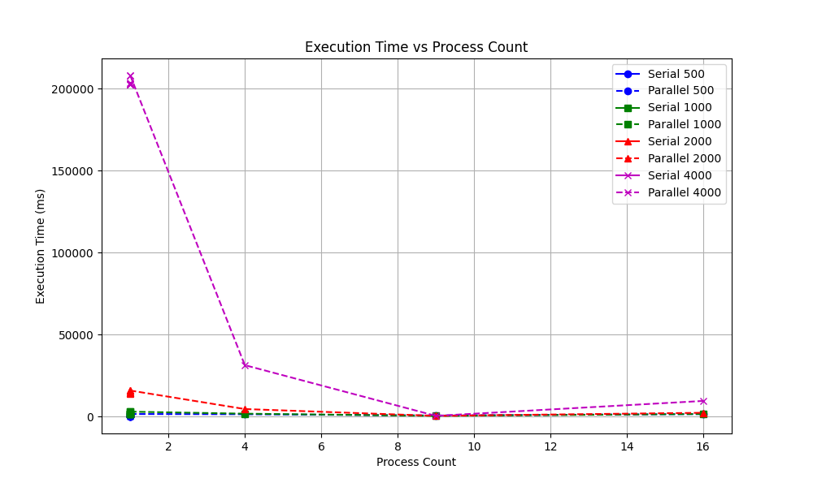

# MPI Cannon's Algorithm for Matrix Multiplication

This repository contains an implementation of Cannon's algorithm for parallel matrix multiplication using the Message Passing Interface (MPI).

## Overview

Cannon's algorithm is a distributed algorithm for matrix multiplication that efficiently distributes the computation across multiple processes in a 2D grid configuration. This implementation focuses on minimizing communication overhead while maximizing computational efficiency for large matrix multiplications.

### Features

- Parallel implementation of matrix multiplication using MPI
- Efficient 2D grid communicator setup for process organization
- Cyclic data distribution for load balancing
- Point-to-point communication for matrix block exchange
- Comprehensive benchmarking and performance analysis
- Comparison with serial implementation

## Performance

This implementation was tested on an HPC cluster (Pronto) with varying matrix sizes (500×500 to 4000×4000) and process counts (1 to 64). Key findings include:

- Significant execution time reduction for large matrices compared to serial implementation
- Performance scaling up to 50+ GFLOPS for large matrices with 32-64 processes
- Optimal scalability observed up to 32 processes for 2000×2000 and 4000×4000 matrices
- Diminishing returns beyond optimal process count due to communication overhead




## Requirements

- C++ compiler with MPI support
- OpenMPI library
- Linux-based operating system (tested on OnDemand HPC cluster)

## Usage

1. Clone the repository:
```bash
git clone https://github.com/muzakker/mpi-cannon-matmul.git
cd mpi-cannon-matmul
```

2. Compile the code:
```bash
mpic++ -o cannon_matmul cannon_matmul.cpp
```

3. Run the program (replace N with matrix size and P with process count):
```bash
mpirun -np P ./cannon_matmul N
```

## Project Structure

- `cannon_matmul.cpp`: Main implementation of Cannon's algorithm
- `serial_matmul.cpp`: Serial implementation for comparison
- `scripts/`: Testing and benchmarking scripts
- `figures/`: Performance visualization graphs
- `results/`: Raw performance data

## Implementation Details

The implementation follows these key steps:

1. **Setup Phase**: Creates a 2D grid communicator for process organization
2. **Data Distribution**: Distributes matrix blocks across processes
3. **Initial Alignment**: Shifts matrix blocks to their initial positions
4. **Computation Phase**: 
   - Each process performs local matrix multiplication
   - Cyclic shifting of matrices along rows and columns
   - Repeated computation and communication steps
5. **Result Collection**: Gathers partial results to form the final matrix

## Findings

- Parallel matrix multiplication using MPI significantly outperforms serial implementation for large matrices
- The optimal number of processes depends on the matrix size and hardware configuration
- Communication overhead becomes a limiting factor in scalability beyond certain process counts
- For best performance, matrix sizes should be balanced against the number of processes

## License

MIT

## Author

Md Muzakker Hossain
